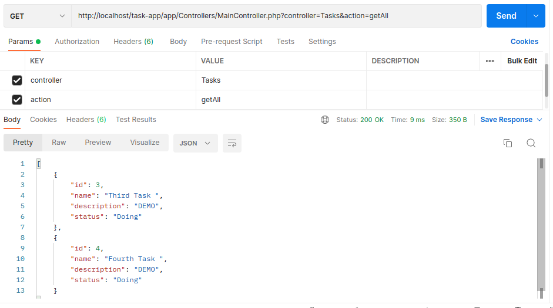
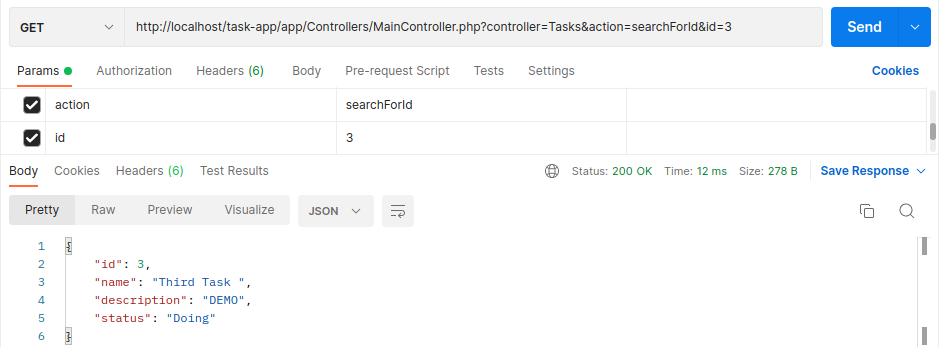
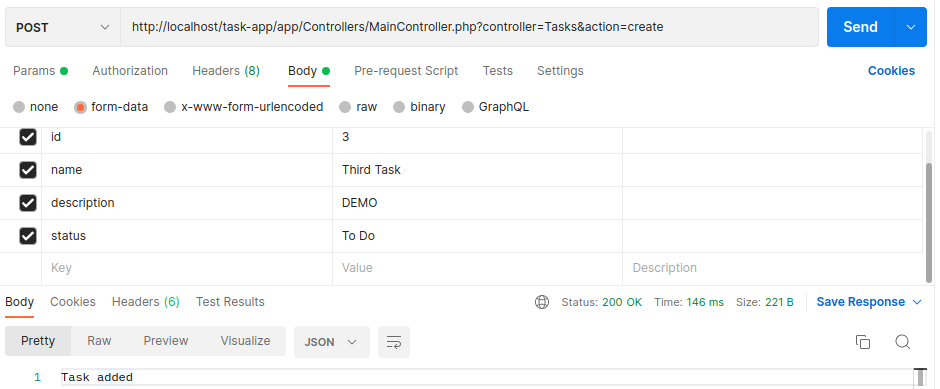
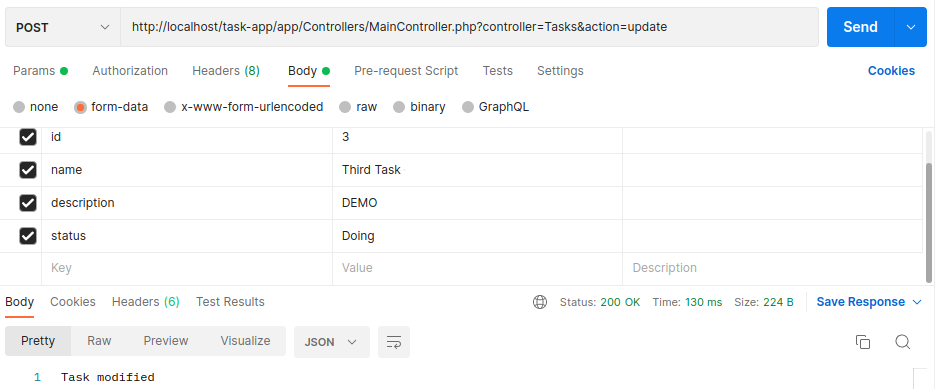
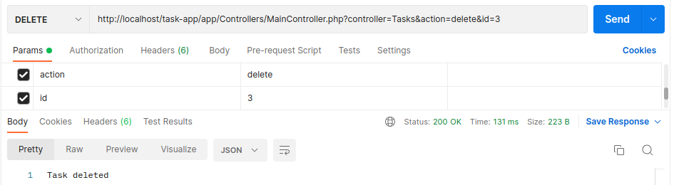

# Task App

Task App web application to list, add, edit, remove your important task or notes.
Developed with PHP-8. (*In development*)


*CRUD REST-API*

### Table of contents 📃

- [Task App](#task-app)
  - [Table of contents 📃](#table-of-contents-)
  - [Starting 🚀](#starting-)
    - [Pre-requirements 📋](#pre-requirements-)
    - [DataBase-Management-System](#DBMS)
    - [Installation 🔧](#installation-)
  - [Deployment 📦](#deployment-)
  - [Built with 🛠️](#built-with-️)


## Starting 🚀
  
### Pre-requirements 📋

* [Git](https://git-scm.com/)
* [Composer](https://getcomposer.org/)
* API PLATFORMS
    * [POSTMAN](https://www.postman.com/)
    * [TUNDER-CLIENT](https://www.thunderclient.com/) - VS Code extension

### Installation 🔧

Local installation:

```bash
# Clone this repository
# linux (ubuntu) /var/www/html/
# windows: 
# for laragon in www folder
# for xammp in htdocs folder
$ git clone https://github.com/JefferGonzalez/Task-App

# Change directory to the project path
$ cd Task-App
```

Setup:
```bash
# Install dependencies
$ composer install
```

### DBMS

In your DataBase Management System: 

Copy and executed the script file of folder (Url 'app/database/script.sql')

.env file setup
```bash
Create an .env file and copy all content of .env.example

Then update .env file with you database credentials
```


## Use 📌

In postman or thunder client (extension) use the following http requests:

* GET
    * Get all: http://localhost/task-app/app/Controllers/MainController.php?controller=Tasks&action=getAll
        </br>
        
    * Search for id: http://localhost/task-app/app/Controllers/MainController.php?controller=Tasks&action=searchForId&id=3
        </br>
        
* POST
    * Create : http://localhost/task-app/app/Controllers/MainController.php?controller=Tasks&action=create
        </br>
        
    * Update : http://localhost/task-app/app/Controllers/MainController.php?controller=Tasks&action=update
        </br>
        
* DELETE : http://localhost/task-app/app/Controllers/MainController.php?controller=Tasks&action=delete&id=3
    </br>
    

## Built with 🛠️

* [PHP](https://www.php.net/) - Programming Languaje
    * [Composer](https://getcomposer.org/) - Dependency Management for PHP
* [MYSQL](https://www.mysql.com) - Database
    * [WORKBENCH](https://www.mysql.com/products/workbench/) - Visual Tool